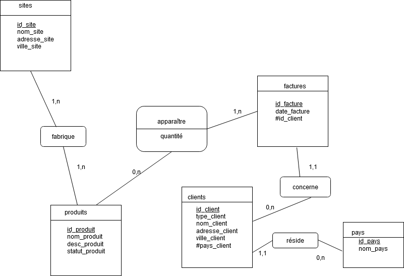
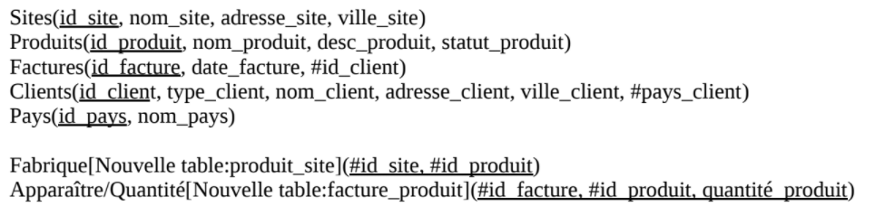
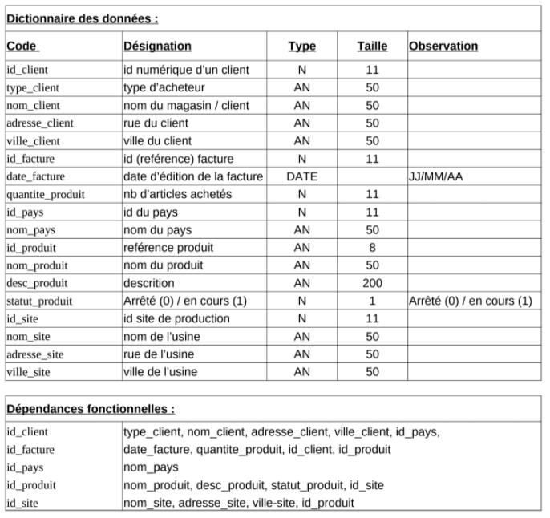
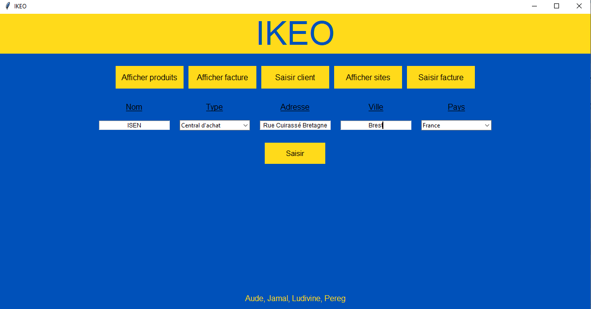
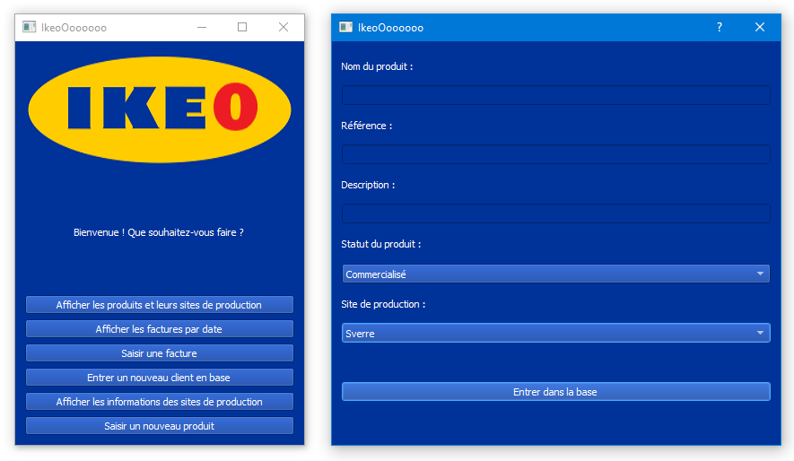

# IKEO

Le projet IKEO a été cré par Aude, Jamal, Ludivine et Pereg. Il permet de gérer la base de données IKEO depuis une interface graphique.

## La base de données
### Modèle conceptuel des données

### Modèle logique des données

### Dictionnaire des données

## Les interfaces
### Tkinter

### PyQT

